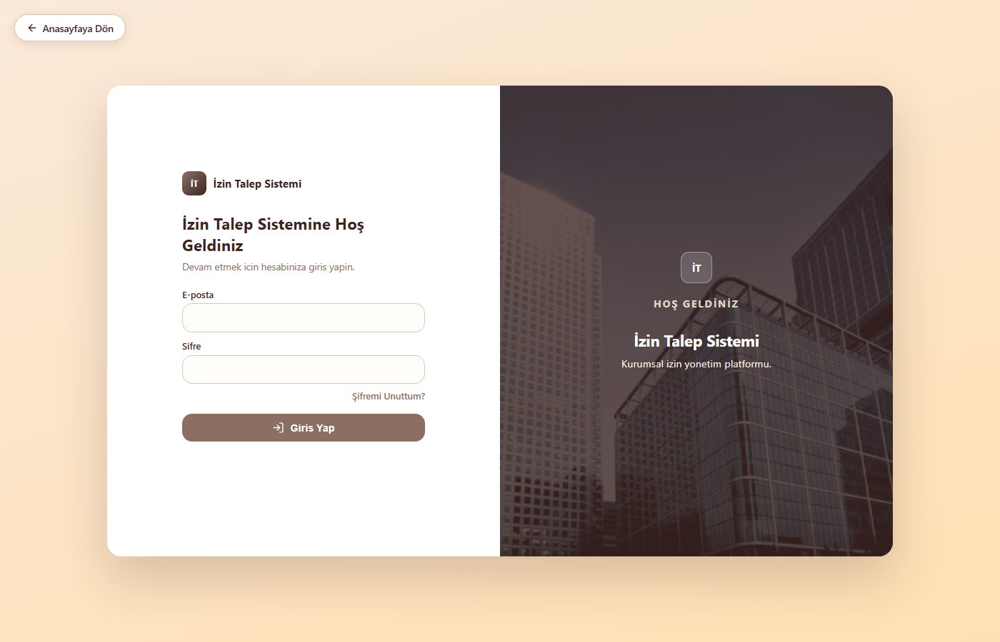
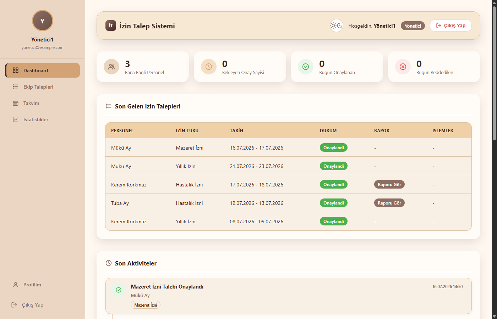
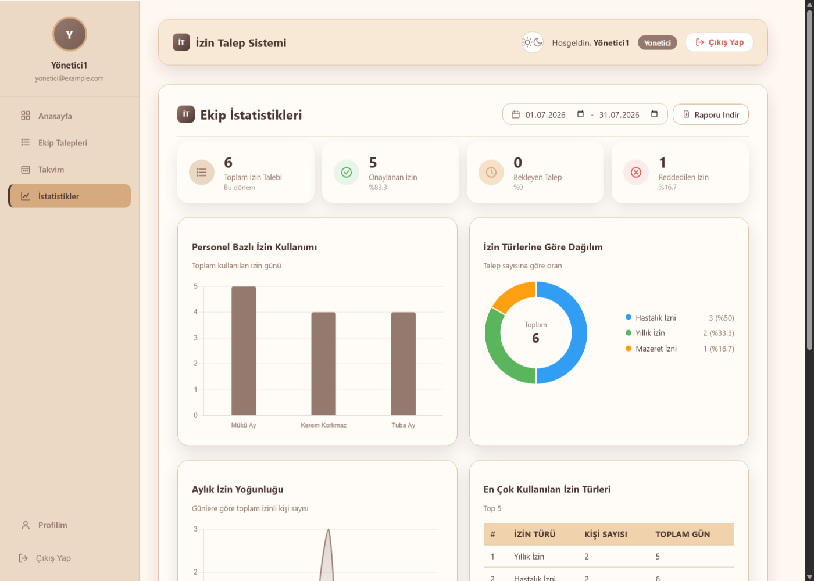

# İzin Talep Sistemi

Çalışanların izin talebi oluşturabildiği, yöneticilerin bu talepleri onaylayıp reddedebildiği ve adminin sistemin tamamını yönetebildiği kurumsal bir izin yönetim web uygulaması.

## İçindekiler

- [Projenin Amacı](#projenin-amacı)
- [Özellikler](#özellikler)
- [Kullanılan Teknolojiler](#kullanılan-teknolojiler)
- [Kurulum](#kurulum)
- [.env Ayarları](#env-ayarları)
- [Veritabanı Kurulumu](#veritabanı-kurulumu)
- [Testler](#testler)
- [Roller](#roller)
- [Ekran Görüntüleri](#ekran-görüntüleri)
- [Geliştirici Bilgileri](#geliştirici-bilgileri)

## Projenin Amacı

Şirket içi izin süreçlerini (yıllık izin, mazeret izni, hastalık izni vb.) kağıt/e-posta trafiğinden çıkarıp tek bir platformda toplamak. Personel talebini sisteme girer, bağlı olduğu yönetici onaylar veya reddeder, admin ise kullanıcı/departman/izin türü yönetimi ile sistemin tamamından sorumludur. Süreç boyunca personel ve yöneticiler e-posta ile bilgilendirilir.

## Özellikler

**Personel**
- İzin talebi oluşturma, düzenleme, iptal etme
- Talep sırasında vekil personel atama (departman içi çakışma/uygunluk kontrolü ile)
- Kendi izin taleplerini ve geçmişini listeleme, filtreleme, PDF/CSV olarak dışa aktarma
- İzin bakiyesi/kota takibi
- Profil bilgilerini ve fotoğrafını güncelleme, karanlık mod

**Yönetici**
- Sadece kendi personelinin taleplerini görme ve onaylama/reddetme (gerekçeli red)
- Toplu onay/red işlemleri
- Ekip takvimi (aylık çizelge PDF çıktısı ile)
- Ekip istatistikleri (grafiklerle: personel bazlı kullanım, izin türü dağılımı, aylık yoğunluk)

**Admin**
- Kullanıcı, departman, izin türü yönetimi (CRUD)
- Tüm izin taleplerini görüntüleme/yönetme, toplu onay/red
- Şirket geneli takvim ve raporlar
- Aktivite/işlem geçmişi

**Genel**
- Rol bazlı yetkilendirme (Admin / Yönetici / Personel)
- Oturum tabanlı güvenli giriş, bcrypt ile şifreleme
- Şifremi unuttum / şifre sıfırlama (e-posta ile, 15 dk geçerli token)
- Otomatik e-posta bildirimleri: talep oluşturulunca yöneticiye, onaylanınca/reddedilince personele, vekalet atandığında vekile
- PWA desteği (çevrimdışı erişim, ana ekrana ekleme)
- Kahverengi/krem tonlarında tutarlı, karanlık mod destekli arayüz

## Kullanılan Teknolojiler

- **Backend:** Node.js, Express.js
- **Veritabanı:** MySQL (mysql2)
- **Kimlik doğrulama:** express-session, bcrypt
- **Doğrulama:** express-validator
- **E-posta:** Nodemailer (Mailtrap SMTP)
- **PDF/rapor:** pdfkit, jsPDF + autotable
- **Grafikler:** Chart.js
- **Takvim:** FullCalendar
- **Frontend:** Vanilla HTML / CSS / JavaScript (PWA)
- **Mimari:** MVC + Controller / Service / Repository katmanları

## Kurulum

Gereksinimler: Node.js 18+, MySQL 8+ (veya uyumlu bir sürüm).

```bash
# 1. Depoyu klonla
git clone https://github.com/tubaay8/izin-talep-sistemi.git
cd izin-talep-sistemi

# 2. Bağımlılıkları kur
npm install

# 3. .env dosyasını oluştur (asağıdaki bölüme bak)
cp .env.example .env

# 4. Veritabanını oluştur ve tabloları kur
npm run db:migrate

# 5. Başlangıç verilerini (roller, departmanlar, izin türleri, demo hesaplar) yükle
npm run db:seed

# 6. Sunucuyu başlat
npm run dev   # geliştirme (nodemon ile otomatik yeniden başlatma)
# veya
npm start     # production
```

Sunucu varsayılan olarak `http://localhost:3000` adresinde çalışır.

## .env Ayarları

`.env.example` dosyasını `.env` olarak kopyalayıp kendi ortamına göre doldur:

| Değişken | Açıklama |
|---|---|
| `PORT` | Sunucunun çalışacağı port (varsayılan 3000) |
| `DB_HOST`, `DB_PORT`, `DB_USER`, `DB_PASSWORD`, `DB_NAME` | MySQL bağlantı bilgileri |
| `SESSION_SECRET` | Oturum (session) imzalama anahtarı — production'da mutlaka değiştirilmeli |
| `COMPANY_NAME`, `COMPANY_ADDRESS` | PDF çıktılarında görünen şirket bilgileri |
| `PDF_FONT_REGULAR`, `PDF_FONT_BOLD` | PDF oluşturma için sistemdeki font dosya yolları |
| `MAILTRAP_API_TOKEN`, `MAILTRAP_INBOX_ID` | [Mailtrap](https://mailtrap.io) sandbox'ının HTTPS API bilgileri — ham SMTP yerine tercih edildi çünkü bazı barındırma platformlarında (örn. Railway) SMTP portlarına giden bağlantı engellenip zaman aşımına uğrayabiliyor |
| `MAIL_FROM` | Gönderilen e-postalarda görünecek "kimden" adresi |
| `APP_URL` | Şifre sıfırlama gibi maillerdeki bağlantıların oluşturulacağı taban adres (örn. `http://localhost:3000`) |

`.env` dosyası `.gitignore` içinde olduğu için asla depoya eklenmez; gerçek kimlik bilgileri sadece kendi ortamında kalır.

## Veritabanı Kurulumu

Şema, `database/migrations/` altındaki sıralı SQL dosyalarıyla oluşturulur (`npm run db:migrate` bunların hepsini sırayla çalıştırır ve veritabanını yoksa oluşturur). Temel tablolar:

> Tüm tabloların kolonları, ilişkileri ve bir ER diyagramı için bkz. [docs/DATABASE_SCHEMA.md](docs/DATABASE_SCHEMA.md).

| Tablo | Açıklama |
|---|---|
| `roles` | Admin / Yönetici / Personel rolleri |
| `departments` | Departmanlar (her birinin bir yöneticisi olabilir) |
| `users` | Kullanıcılar (role, departmana ve varsa bir yöneticiye bağlı) |
| `leave_types` | İzin türleri (Yıllık, Mazeret, Hastalık vb.) |
| `leave_requests` | İzin talepleri (durum, onay bilgisi, vekil, rapor dosyası) |
| `leave_balances` | Personelin izin türü bazlı yıllık bakiye/kota takibi |
| `activity_logs` | Sistem üzerindeki onay/red/güncelleme işlemlerinin geçmişi |
| `password_reset_tokens` | Şifre sıfırlama token'ları (sadece hash olarak saklanır) |

`npm run db:seed` çalıştırıldığında `database/seeds/` altındaki dosyalarla roller, örnek departmanlar, örnek izin türleri ve aşağıdaki demo hesaplar oluşturulur:

| Rol | E-posta | Şifre |
|---|---|---|
| Admin | `admin@example.com` | `sifre123` |
| Yönetici | `yonetici@example.com` | `sifre123` |

Personel hesabı seed edilmez; Admin ile giriş yaptıktan sonra **Kullanıcı Yönetimi** sayfasından yeni bir Personel hesabı oluşturup test edebilirsin.

## Testler

Jest + Supertest ile yazılmış entegrasyon testleri var (`tests/` klasörü) — giriş, şifre sıfırlama, izin talebi oluşturma/güncelleme/iptal, yönetici ve admin onay/red akışları ile rol bazlı yetkilendirme sınırlarını gerçek bir Express uygulaması + ayrı bir test veritabanına karşı test eder.

```bash
npm test
```

Testler kendi izole veritabanını (`DB_NAME` + `_test`) her çalıştırmada sıfırdan kurup migration/seed dosyalarını uygular, bittiğinde siler — **geliştirme veritabanına asla dokunmaz**. `.env` dosyandaki DB bağlantı bilgilerini kullanır, ayrı bir yapılandırmaya gerek yoktur.

## Roller

- **Admin:** Sistemin tamamını yönetir — kullanıcı, departman, izin türü tanımları; tüm izin taleplerini görüntüleme ve gerektiğinde doğrudan onaylama/reddetme; şirket geneli takvim ve raporlar.
- **Yönetici:** Sadece kendisine bağlı personelin izin taleplerini görür, onaylar veya gerekçeli olarak reddeder; ekip takvimi ve ekip istatistiklerine erişir.
- **Personel:** Kendi izin taleplerini oluşturur, düzenler, iptal eder; geçmiş taleplerini ve izin bakiyesini görüntüler.

## Ekran Görüntüleri

| Giriş Ekranı | Yönetici Paneli |
|---|---|
|  |  |

| Ekip İstatistikleri |
|---|
|  |

## Geliştirici Bilgileri

- **Geliştirici:** Tuba Ay
- **Proje türü:** Staj projesi
- **Depo:** [github.com/tubaay8/izin-talep-sistemi](https://github.com/tubaay8/izin-talep-sistemi)
