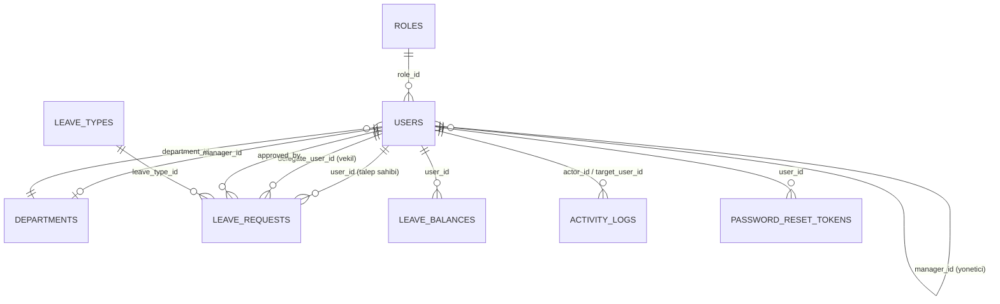

# Veritabanı Şeması

Bu doküman, `database/migrations/` altındaki sıralı SQL dosyalarının çalıştırılmasıyla oluşan MySQL şemasını özetler. Şemayı doğrudan bilgisayarında kurmak için proje kökünden `npm run db:migrate` komutunu çalıştırman yeterli — bu dosya sadece referans amaçlıdır.

## İlişki Diyagramı

## Tablolar

### `roles`
Sistemdeki üç rolü tutar: Admin, Yonetici, Personel.

| Kolon | Tip | Açıklama |
|---|---|---|
| `id` | `INT UNSIGNED PK` | |
| `name` | `VARCHAR(50) UNIQUE` | Rol adı |
| `description` | `VARCHAR(255)` | |
| `created_at`, `updated_at` | `TIMESTAMP` | |

### `departments`
| Kolon | Tip | Açıklama |
|---|---|---|
| `id` | `INT UNSIGNED PK` | |
| `name` | `VARCHAR(100) UNIQUE` | Departman adı |
| `manager_id` | `INT UNSIGNED UNIQUE, FK → users.id` | Departmanın yöneticisi (opsiyonel) |
| `created_at`, `updated_at` | `TIMESTAMP` | |

### `users`
| Kolon | Tip | Açıklama |
|---|---|---|
| `id` | `INT UNSIGNED PK` | |
| `full_name` | `VARCHAR(100)` | |
| `email` | `VARCHAR(150) UNIQUE` | Giriş için kullanılır |
| `profile_photo` | `VARCHAR(255) NULL` | Yüklenen profil fotoğrafının dosya adı |
| `password` | `VARCHAR(255)` | bcrypt hash |
| `must_change_password` | `TINYINT(1)` | Admin tarafından geçici şifreyle oluşturulan hesaplar için |
| `role_id` | `INT UNSIGNED, FK → roles.id` | |
| `department_id` | `INT UNSIGNED, FK → departments.id` | |
| `manager_id` | `INT UNSIGNED NULL, FK → users.id` | Kendine referans — bağlı olduğu yönetici |
| `is_active` | `TINYINT(1)` | Pasif kullanıcılar giriş yapamaz |
| `created_at`, `updated_at` | `TIMESTAMP` | |

### `leave_types`
| Kolon | Tip | Açıklama |
|---|---|---|
| `id` | `INT UNSIGNED PK` | |
| `name` | `VARCHAR(50) UNIQUE` | Örn. Yıllık İzin, Mazeret İzni, Hastalık İzni |
| `description` | `VARCHAR(255) NULL` | |
| `counts_toward_quota` | `TINYINT(1)` | Bu tür, personelin yıllık izin kotasından düşülsün mü |
| `created_at`, `updated_at` | `TIMESTAMP` | |

### `leave_requests`
Sistemin merkezindeki tablo.

| Kolon | Tip | Açıklama |
|---|---|---|
| `id` | `INT UNSIGNED PK` | |
| `user_id` | `INT UNSIGNED, FK → users.id` | Talebi oluşturan personel |
| `leave_type_id` | `INT UNSIGNED, FK → leave_types.id` | |
| `start_date`, `end_date` | `DATE` | |
| `reason` | `VARCHAR(500) NULL` | Personelin açıklaması |
| `delegate_user_id` | `INT UNSIGNED NULL, FK → users.id` | İzin süresince vekalet bırakılan kişi |
| `report_file` | `VARCHAR(255) NULL` | Hastalık izni için yüklenen rapor dosyası |
| `status` | `ENUM('pending','approved','rejected','cancelled')` | Varsayılan `pending` |
| `approved_by` | `INT UNSIGNED NULL, FK → users.id` | Kararı veren yönetici/admin |
| `approval_note` | `VARCHAR(500) NULL` | Özellikle red gerekçesi için kullanılır |
| `decided_at` | `DATETIME NULL` | |
| `created_at`, `updated_at` | `TIMESTAMP` | |

### `leave_balances`
Personelin yıl bazlı izin bakiyesi/kota takibi.

| Kolon | Tip | Açıklama |
|---|---|---|
| `id` | `INT UNSIGNED PK` | |
| `user_id` | `INT UNSIGNED, FK → users.id` | |
| `year` | `SMALLINT UNSIGNED` | |
| `entitled_days` | `SMALLINT UNSIGNED` | Hak edilen gün sayısı (varsayılan 14) |
| `used_days` | `SMALLINT UNSIGNED` | Kullanılan gün sayısı |
| `created_at`, `updated_at` | `TIMESTAMP` | |

### `activity_logs`
Onay/red/güncelleme gibi işlemlerin denetim (audit) kaydı.

| Kolon | Tip | Açıklama |
|---|---|---|
| `id` | `INT UNSIGNED PK` | |
| `actor_id` | `INT UNSIGNED NULL, FK → users.id` | İşlemi yapan kullanıcı |
| `actor_name`, `actor_role` | `VARCHAR` | İşlem anındaki isim/rol (kullanıcı silinse bile okunabilir kalır) |
| `target_user_id` | `INT UNSIGNED NULL, FK → users.id` | İşlemden etkilenen kullanıcı |
| `action_type` | `VARCHAR(50)` | Örn. `LEAVE_REQUEST_APPROVED` |
| `description` | `VARCHAR(500)` | İnsan tarafından okunabilir özet |
| `created_at` | `TIMESTAMP` | |

### `password_reset_tokens`
"Şifremi unuttum" akışı için. Ham token e-posta ile gönderilir, veritabanında sadece SHA-256 özeti tutulur.

| Kolon | Tip | Açıklama |
|---|---|---|
| `id` | `INT UNSIGNED PK` | |
| `user_id` | `INT UNSIGNED, FK → users.id` | |
| `token_hash` | `CHAR(64) UNIQUE` | Token'ın SHA-256 özeti |
| `expires_at` | `DATETIME` | Oluşturulmadan 15 dakika sonrası |
| `used_at` | `DATETIME NULL` | Doldurulmuşsa token tekrar kullanılamaz |
| `created_at` | `TIMESTAMP` | |

## Notlar

- Tüm tablolar `InnoDB` motoru ve `utf8mb4 / utf8mb4_turkish_ci` karakter seti ile oluşturulur (Türkçe karakter ve sıralama desteği için).
- Yabancı anahtarların çoğu `ON DELETE SET NULL` veya `ON DELETE CASCADE` ile tanımlıdır (detaylar için ilgili migration dosyasına bakılabilir); bu sayede bir kullanıcı silinse dahi geçmiş kayıtlar (activity_logs gibi) kaybolmaz.
- Migration dosyaları idempotent yazılmıştır (`CREATE TABLE IF NOT EXISTS`, `ADD COLUMN IF NOT EXISTS`), yani `npm run db:migrate` güvenle birden fazla kez çalıştırılabilir.
